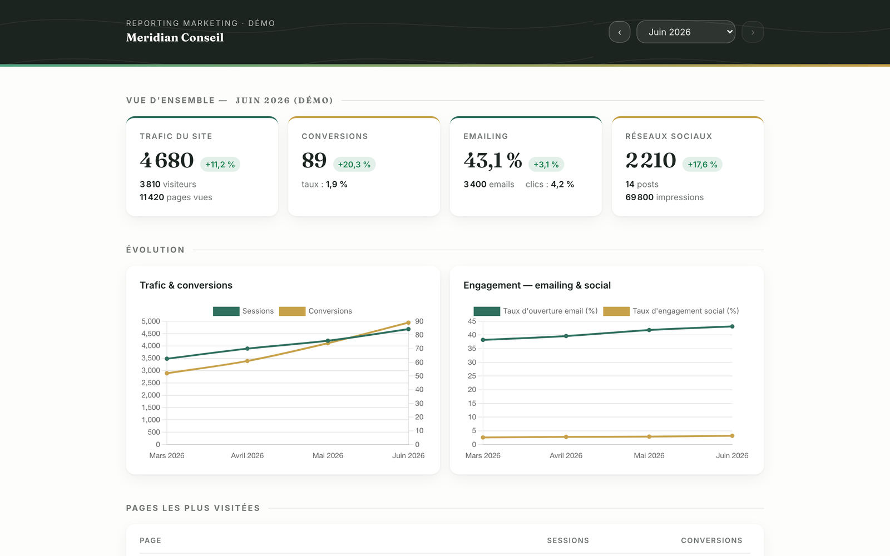

# Marketing Cockpit Template

**Your marketing department, running inside Claude Code — and it knows your brand by heart.**

49 production skills · 10 specialist agents · 52 slide layouts · 20 ready-to-open page templates · 7 optional modules. Built and battle-tested by [Jessy Martin](https://jessem.fr) on real client accounts, then open-sourced.

[](LICENSE)
[](https://docs.anthropic.com/en/docs/claude-code/overview)
[](#whats-inside)
[](#whats-inside)

Clone it once per company, run the wizard, and get a role-based cockpit that operates like a marketing director: strategy, social, email, landing pages, design, presentations, SEO — plus optional modules for video, n8n automation, client-facing reporting and outbound acquisition. Every deliverable is a file in your repo. Every word passes a brand gate before it ships.

---

## See it before you install it

Everything below ships in the template and opens in a browser with zero build step. The demo brand ("Meridian Conseil") is 100% fictional; the wizard reskins everything with *your* tokens.


| Waterfall data-viz layout | Quote + portrait layout |
|---|---|
|  |  |

*Three of the 52 slide layouts, captured in full-screen presentation mode from the self-documenting catalogue (each slide carries its own usage note). 7 families: opening, editorial, dataviz, diagrams, tables, proof, closing. The `slides` skill picks layouts by message type, then reskins them with your brand tokens.*

| Landing pages (10 templates) | Interactive lead magnets (10 templates) |
|---|---|
|  |  |
|  |  |


*The reporting module: a static, brand-styled dashboard deployed on the client's own site (plain FTP, access code, monthly JSON snapshots, written analysis). No SaaS subscription.*

*`/start-cockpit`: fetches your website, analyzes your content, drafts your brand doctrine for validation, wires your tools. 30–60 minutes.*

---

## Real results, real clients

Everything above uses the fictional demo brand. Everything below is real: this template is not a demo — it is the daily production tool of a working marketing practice, running several live brands. Click any link and check for yourself.

### Three live sites run with this cockpit

| [n2.help](https://n2.help) | [qiplim.com](https://qiplim.com) |
|---|---|
|  |  |
| *N2 Help & Solutions — B2B IT-services client: social content, carousels, newsletters and interactive resources produced with this system.* | *Qiplim — the maintainer's own SaaS: launch content, landing copy and brand visuals shipped with this system.* |

| [jessem.fr](https://jessem.fr) | [n2.help/resources](https://n2.help/resources) |
|---|---|
|  |  |
| *jessem.fr — the marketing practice this template comes from; the site is written, launched and run with it.* | *N2's resources hub — reports, case studies and articles fed by this cockpit.* |

### Live lead magnets built with this system

Three interactive lead magnets you can open and use right now — each built by the `lead-magnet` skill with its full capture circuit (page → form → nurturing).

| [jessem.fr/diagnostic](https://jessem.fr/diagnostic/) | [jessem.fr/diagnostic-collab](https://jessem.fr/diagnostic-collab/) | [ServiceNow Expertise Report 2026](https://n2.help/tools/servicenow-expertise-report-2026) |
|---|---|---|
|  |  |  |
| *Interactive marketing diagnostic — the author's own lead magnet.* | *Interactive Content & AI maturity diagnostic ("La Collab").* | *Interactive industry report — 136 respondents across 20 countries.* |

### Real deliverables, shipped

| | | |
|---|---|---|
|  |  |  |

*Three pages from a real LinkedIn carousel on the EU AI Act (10 pages, 1080×1350 PDF), produced by the `carousel` skill and published in June 2026.*

| | |
|---|---|
|  |  |

*Brand visuals generated by the system (Gemini image pipeline + brand doctrine): LinkedIn post visuals for Qiplim.*

### And it ranks


*478 clicks (+99%) and 12.6k impressions in the first 3 months of a freelance marketing site launched with this system — Google Search Console.*

---

## Why this exists

Generic AI marketing output has a smell. Same adjectives, same em-dash rhythm, same "in today's fast-paced world" openers — and no memory of what you published last Tuesday.

This template is the actual working tool of an externalized marketing practice. It encodes what running AI marketing for real clients forces you to solve:

- **A brand doctrine as single source of truth** — voice, banned vocabulary, personas, design tokens, anti-AI-style rules — that every skill loads *before writing a single word*.
- **Deterministic quality gates** — a PostToolUse hook fires a mandatory brand check whenever content lands in a production folder. The harness enforces the workflow, not the model's goodwill.
- **File-based memory** — an editorial calendar with statuses (`idea → draft → to-validate → validated → published`), per-channel archives and inventory files provide anti-repetition and auditability with zero external database.

## How it works

```
Core (always on)                       Optional modules (/modules)
┌─────────────────────────────┐        ┌──────────────────────────────┐
│ 00-intel    live context    │        │ 08-video        Palmier Pro  │
│ 01-brand    doctrine (SSOT) │        │ 10-automations  n8n engine   │
│ 02-strategy calendar + KPIs │───────▶│ 11-reporting    client-site  │
│ 03→07, 09   production roles│        │                 dashboard    │
│ wizard + skills + agents    │        │ 12-acquisition  ads + outbound│
└─────────────────────────────┘        │ + veille, Postiz, client FTP │
        │                              └──────────────────────────────┘
        ▼
 Everything reads 01-brand/ first — no generic AI voice, ever.
```

Three mechanics do the heavy lifting:

1. **A marketing director, not a channel executor.** The root `CLAUDE.md` makes Claude start from the business objective (awareness, leads, conversion, retention), route the request through a routing table to the right skill/agent, and propose an argued channel mix when the ask is vague — instead of replying "which channel do you want?".
2. **Brand doctrine injection.** Each numbered folder is a marketing role with its own `CLAUDE.md` (scope, inputs, workflow, validation gates). Every production skill loads `01-brand/` (voice, messaging framework with sourced numbers, style guide, personas) before producing anything. Claims without a source in the messaging framework don't ship.
3. **The calendar loop.** Work starts by reading `02-strategy/calendar/calendar.md` and recent intel, and ends by updating entry statuses and anti-repetition inventories. The cockpit knows what was published, what's in review, and what's planned — across sessions.

## Quickstart

Prerequisites: [Node.js 18+](https://nodejs.org) and a Claude account (Pro/Max, Team, Enterprise, or an API key) for [Claude Code](https://docs.anthropic.com/en/docs/claude-code/overview).

```bash
# 1. Install Claude Code (once per machine)
npm install -g @anthropic-ai/claude-code

# 2. Clone under a name that makes sense for you (or "Use this template" on GitHub)
git clone https://github.com/Littlpinguin/marketing-cockpit-template.git my-company-cockpit
cd my-company-cockpit

# 3. Create your local env file (filled in later by the wizard)
cp .env.example .env

# 4. Install Python deps
python3 -m pip install pyyaml python-dotenv requests

# 5. Open Claude Code
claude
```

> **macOS note (PEP 668).** Recent macOS/Homebrew Python installs refuse system-wide `pip install` ("externally managed environment"). Use `python3 -m pip install --user pyyaml python-dotenv requests`, or create a virtualenv first: `python3 -m venv .venv && source .venv/bin/activate`.

Then run the wizard (paste on its own line):

```
/start-cockpit
```

It fetches your website, analyzes your recent content, drafts your brand doctrine for your validation, runs a strategy interview (objectives, channels, personas, customer journey), wires your tools, and hands you a ready cockpit in 30–60 minutes. Enable optional modules any time with `/modules`.

## What's inside

**49 skills**, organized by function (all in `.claude/skills/`):

| Category | Skills | Count |
|---|---|---|
| Writing & editing | `copywriting`, `copy-editing` (7-pass review), `humanize-writing` (anti-AI-tells), `translation`, `social-content`, `email`, `email-deliverability`, `event-marketing` | 8 |
| Design & presentations | `design-system`, `design-direction`, `design-review`, `design-taste`, `design-redesign`, `brandkit`, `image-generation`, `slides` (52-layout HTML decks + Playwright QA), `carousel` (LinkedIn PDF) | 9 |
| Web & CRO | `landing-page`, `lead-magnet` (with full capture circuit), `cro-page`, `cro-form`, `cro-popup`, `cro-pricing`, `accessibility-web` (WCAG 2.2 AA) | 7 |
| SEO & content engine | `seo`, `seo-audit`, `seo-schema`, `seo-geo` (AI-search/AEO), `seo-cluster`, `blog-engine` (fact-checked articles, ≥90/100 quality gate) | 6 |
| Strategy & intelligence | `content-strategy`, `veille-strategy` (market watch), `scraping`, `performance-report` | 4 |
| Governance & plumbing | `cockpit-setup` (wizard), `brand-check` (the quality gate), `inventory`, `sync-template`, `backport-to-template` | 5 |
| Paid acquisition | `sea-google-ads`, `ads-audit` (Google/Meta/LinkedIn audit grids, ~157 checks) | 2 |
| Video | `video-editing`, `captions` | 2 |
| Web animation | `animation-gsap` (GSAP + ScrollTrigger), `animation-animejs`, `animation-lottie`, `animation-scroll-reveal` (AOS & co) | 4 |

**10 agents** (`.claude/agents/`): `brand-guardian`, `qa-visuel`, `a11y-auditor`, `seo-technical`, `seo-content`, `seo-google`, `sea-analyst`, `veille-analyst`, `performance-analyst`, `n8n-debugger` — dispatched in parallel for audits and multi-channel campaigns.

**Working assets, not lorem ipsum:**

- **52 slide layouts** in 7 families (`_examples/deck-catalogue/catalogue.html`) — a self-documenting HTML deck: keyboard nav, grouped overview, fullscreen mode, PDF export with gradient-text rasterization, automated Playwright QA (contrast AA, ≥18px type, overflow checks).
- **10 landing page templates** (`05-web-content/templates/landing-pages/`) — one per conversion goal (B2B demo, SaaS trial, lead magnet, webinar, pricing, competitor comparison, long-form sales, local one-pager, waitlist, service). Single-file, responsive, GA4/UTM conventions wired.
- **10 interactive lead magnets** (`05-web-content/templates/lead-magnets/`) — ROI calculator, diagnostic score, grader, quiz, budget estimator… all with an email capture gate and nurturing segmentation baked in.
- **A client reporting dashboard** (`11-reporting/`) — static HTML + monthly JSON snapshots + written analysis, deployed on the client's own site by FTP behind an access code. A demo with 4 months of fictional data (all sources, embedded — opens on double-click) lives in `11-reporting/dashboard/demo/index.html`.
- **A fictional starter corpus** (`_examples/acme-saas/`) to calibrate tone on day one, and **6 slash commands** (`/start-cockpit`, `/brand-discover`, `/tools-setup`, `/modules`, `/validate-setup`, `/health-check`).

## Modules

| Module | What it adds | Prerequisites |
|---|---|---|
| `veille` | Multi-level market watch (competitors, sector, trends) feeding the calendar with **sourced** content ideas | — |
| `video` | AI-assisted video editing & captions | macOS + [Palmier Pro](https://github.com/palmier-io/palmier-pro) |
| `automatisations` | Build, debug and evolve n8n workflows from Claude (5-phase method, 5,100+ template libraries, `n8n-builder`/`n8n-audit`/`n8n-debugger`); feeds `00-intel/`, watch, reports | Self-hosted n8n (VPS guide included) |
| `reporting` | Brand-styled performance dashboard hosted on the client's site (FTP + access code), monthly snapshots, month-to-month navigation, written analysis | ≥ 1 data source (GA4/GSC, Postiz, email tool) |
| `acquisition` | Outbound campaigns: the cockpit does ICP + brand-voice sequences + lists, [Lemlist MCP](https://developer.lemlist.com/mcp/setup) does sending & deliverability; plus Google Ads operations and multi-platform ads audits | Lemlist account |
| `publication-sociale` | Direct scheduling via [Postiz](https://postiz.com) (open source, self-hostable) | Postiz instance |
| `espace-client` | One password-protected space on your site: dashboard + shared presentations | FTP access |

## Why not just ChatGPT? Why not just a template?

Honest answers, because you'll figure them out anyway:

- **vs. a chat session (ChatGPT, Claude.ai, …):** a chat has no filesystem. This repo *is* the memory — brand doctrine, editorial calendar with statuses, per-channel archives, inventories. The brand gate is a deterministic hook, not a system prompt you hope survives the context window. Deliverables are versioned files (HTML decks, landing pages, dashboards), not text to copy-paste.
- **vs. a prompt pack or a "mega-prompt":** prompts don't ship 52 QA'd slide layouts, 20 working page templates, a dry-run connector layer, or a wizard that regenerates role docs based on the tools you actually use.
- **vs. an agency:** this is an operational framework, not outcomes-as-a-service. It needs your inputs, your validation, and someone who can tell good marketing from bad. It makes a competent operator much faster; it doesn't replace judgment.

**What it is *not*:** not an autopilot (human validation is a designed-in step, sending/scheduling stays manual or goes through dry-run gates), not a social scheduler (that's Postiz, optional), and not magic on an empty brand — see ["What good requires"](#what-good-requires).

**One more honest note:** this was built in a French studio. Some internal skill files are written in French (Claude reads them natively — it makes no difference at runtime), and your cockpit's *output* language is whatever you configure at setup (monolingual or bilingual). Full English-first internals are on the roadmap.

## Data privacy — read this before wiring your CRM

The wizard connects to tools holding customer data (CRM, email marketing, analytics, meeting transcripts). Know your Claude plan before you do:

- **Commercial offerings** (Claude Team, Enterprise, API) do **not** train models on your data; API logs are deleted after 7 days.
- **Consumer plans** (Free/Pro/Max) default to **opt-in for model training** — check your settings before connecting business data.
- **EU data residency** requires Claude via AWS Bedrock (EU inference profiles) or Google Vertex AI (EU endpoints) — the direct API has no EU-only option.

References: [Anthropic training policy](https://privacy.claude.com/en/articles/7996868-is-my-data-used-for-model-training) · [Anthropic Trust Center](https://trust.anthropic.com). The wizard repeats this notice (with explicit confirmation) whenever a sensitive connector is configured.

**Security non-negotiables** (full rules in [`SECURITY.md`](SECURITY.md)): secrets in `.env` (scripts) or in the local, untracked `.mcp.json` (MCP servers) — both gitignored, never in chat, commits, or any tracked file; dry-run before any production push; verify API endpoints; never share transcripts containing client data.

## What "good" requires

This template produces an **operational framework**, not polished marketing on day one. Quality needs: a brand universe (the wizard shapes it with you), some public content to calibrate the voice against, and your real tools wired in. The more honest your inputs, the less generic the output.

## Standing on the shoulders of giants

The best community skills are **vendored** (copied, adapted, attributed) rather than required as plugin dependencies, so a fork works standalone. Licenses were verified at fetch time; every adapted skill carries an attribution footer, and full provenance registers live in [`docs/vendored-*.md`](docs/):

| Upstream project | Author | What we adapted | License |
|---|---|---|---|
| [claude-seo](https://github.com/AgriciDaniel/claude-seo) | AgriciDaniel | SEO audit, schema, GEO/AEO, clustering skills + 3 SEO agents | MIT |
| [claude-ads](https://github.com/AgriciDaniel/claude-ads) | AgriciDaniel | Multi-platform ads audit (Google/Meta/LinkedIn grids) | MIT |
| [claude-blog](https://github.com/AgriciDaniel/claude-blog) | AgriciDaniel | Fact-checked article engine with a 100-point quality gate | MIT |
| [ui-ux-pro-max](https://github.com/nextlevelbuilder/ui-ux-pro-max-skill) | NextLevelBuilder | Styles/palettes/typography data + UX review grid | MIT |
| [taste-skill](https://github.com/Leonxlnx/taste-skill) | Leonxlnx | Design execution protocol, redesign audit, brandkit | MIT |
| [frontend-design](https://github.com/anthropics/claude-code) | Anthropic | Design direction (intentional, non-templated UI) | Apache-2.0 |
| [marketingskills](https://github.com/coreyhaines31/marketingskills) | Corey Haines | CRO for pages, forms, popups, pricing | MIT |
| [humanize-writing](https://github.com/jpeggdev/humanize-writing) | jpeggdev | 8-pass de-AI-ification + AI-tells reference | MIT |
| [claude-translation-skill](https://github.com/senshinji/claude-translation-skill) | senshinji | Multi-agent translation pipeline with brand glossary | MIT |
| [claudedesignskills](https://github.com/freshtechbro/claudedesignskills) | freshtechbro | Web animation skills (GSAP/ScrollTrigger, Anime.js, Lottie, AOS) | MIT |
| [email-marketing-bible](https://github.com/CosmoBlk/email-marketing-bible) | CosmoBlk | Deliverability triage, compliance table, dark-mode-safe design | MIT |
| [accessibility-agents](https://github.com/Community-Access/accessibility-agents) | Taylor Arndt | WCAG 2.2 AA web referential + a11y audit agent | MIT |

Each register documents what was kept, what was cut and why, plus a re-sync procedure. If you're an upstream author and want anything changed, open an issue.

## Roadmap

- **English-first internals** — translate the remaining French-language skill files (output language is already configurable).
- **SEO extensions** — re-vendor `seo-local` / `seo-maps` / `seo-ecommerce` for local and e-commerce use cases (deliberately excluded from core).
- **A/B testing** — an `ab-test-setup` path once a lightweight experimentation harness is chosen.
- **More connectors** — additional email/CRM/analytics targets in `/tools-setup`.
- **More templates** — additional slide families and landing page archetypes.

## Professional installation

This template is the working tool of an externalized marketing & communications practice. If you'd rather have it installed, calibrated on your brand and your team trained on it, Jessy Martin offers a done-for-you setup: [jessem.fr](https://jessem.fr).

## License & usage

MIT — see [`LICENSE`](LICENSE). This is a **template**: hit "Use this template" on GitHub to create your own copy, then adapt it to your brand — your copy is yours, brand content and all. Found a bug or something misleading? [Open an issue](../../issues).

If this template saves you a hire's worth of grunt work — or just an afternoon — **a ⭐ helps other marketers find it.**
